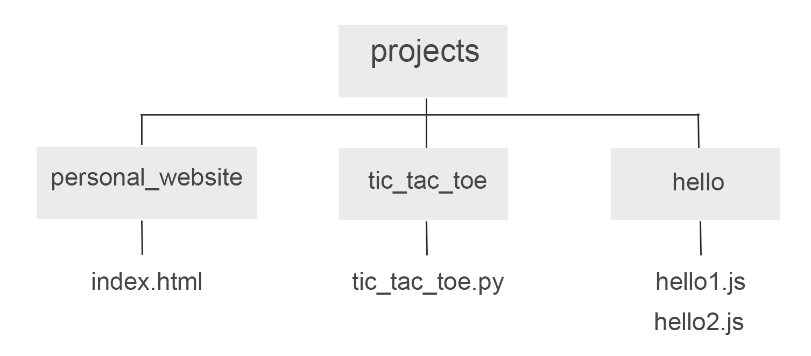
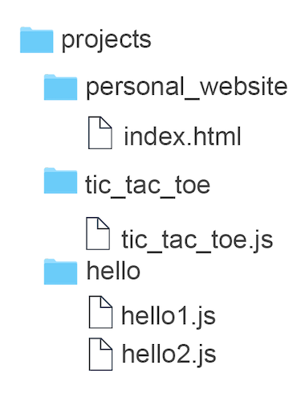
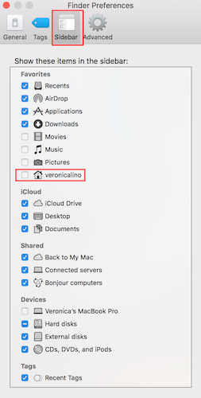

+++
title = "CLI 101"
outputs = ["Reveal"]
+++

# CLI 101

Command Line Interface Basics

---

## Overview

- What is a CLI?
- Why use it?
- How to use it
- How to navigate the file system

---

## What is a CLI?

CLI stands for **command line interface**. A way to communicate directly with a computer.

---

## Why use a CLI?

- Can perform actions more efficiently
- Access areas of the computer that aren't accessible in a GUI
- Configure your machine for programming

---

# How to Use CLI

---

## Running Commands

```sh
pwd
```

---

## Using Arguments

```sh
ls
ls -long
ls -l
```

---

## Creating Files & Directories

```sh
mkdir {name}
touch {name}
```

---

## What do these commands do?

---

```sh
git status
```

---

```sh
rm -rf ./Sample
```

---

```sh
/usr/bin/ruby -e "$(curl -fsSL https://raw.githubusercontent.com/Homebrew/install/master/install)"
```

---

## How to Navigate the File System

---

## Let's create the following project



---

## File Structure



---

{}

## Commands

---

### Recap Commands

```
pwd
ls
touch
mkdir
```

---

### Putting Repos in One Place

```
cd ~
mkdir repos
```

---

### Updating the Finder Sidebar



---

# Demo

{}

---

# Summary

- Commands (`pwa`)
- Arguments (`ls -la`)
- Move around (`cd ../`)
- Making files (`touch`)
- Making directories (`mkdir`)
- Deleting files (`rm`)

---

# Q&A

---

# Done

[Back to home](/#/1)
