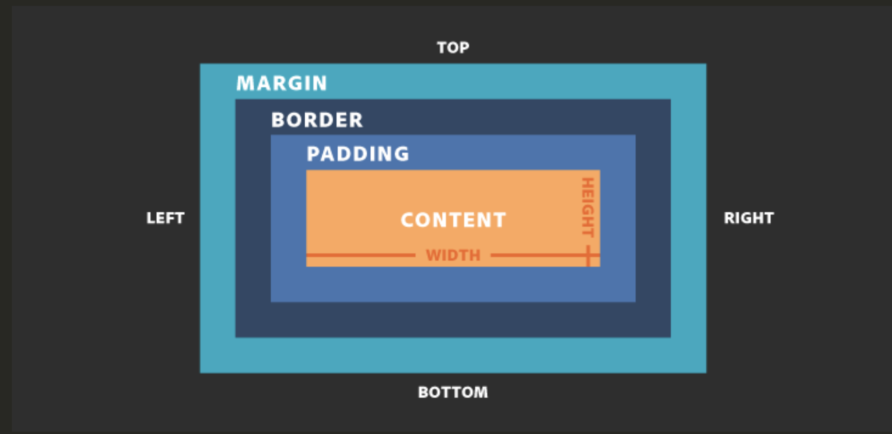

+++
title = "CSS Box Model"
outputs = ["Reveal"]
+++

# CSS Box Model

---

### CSS Box Model Overview

- What is the box model
- Margin
- Border
- Padding
- Width/Height
- Overflow
- Display (block, inline, inline-block)

---

### What is the box model



---

## Margin

The space around, but not including, the box.

```css
margin-top: 50px;
margin-right: 50px;
margin-bottom: 50px;
margin-left: 50px;
```

```css
margin: 50px 50px 50px 50px;
margin: 50px 50px;
margin: 50px;
```

---

## Border

Between the margin and padding, begins the "content" of the box model.

```cs
border-width: 3px;
border-style: solid;
border-color: black
border: 3px solid black;
```

```css
/* top, bottom, left, right */
border-width-top: 3px;
border-style-top: solid;
border-color-top: black;
```

---

## Padding

"Breathing room" between the content and border/margin.

```css
padding-top: 10px;
padding-right: 30px;
padding-bottom: 10px;
padding-left: 30px;
padding: 10px 30px;
```

---

## Width/Height

The width and/or height of an element can be explicitly defined.

```css
width: 80%;
height: 100vh;
```

---

## Overflow

When content is too large to fit into it's container overflow occurs.

```css
overflow: scroll;
```

---

## Image Fix

```css
max-width: 100%;
height: auto;
```

---

## Border Box

How is `width` measured? How to do we make it easier?

```css
box-sizing: border-box;
```

---

### Display Property

`none`, `inline`, `block`, `inline-block`, `table-cell`

- Describe `inline` vs `block`
- Can you set the width & hight of an `inline` element
- What is `inline-block`?

---

### Building Layout

Let's create a simple page layout ourselves together.

---

### CSS Box Model

- Summary
- What is the box model
- Margin
- Border
- Padding
- Width/Height
- Overflow
- Display (block, inline, inline-block)

---
