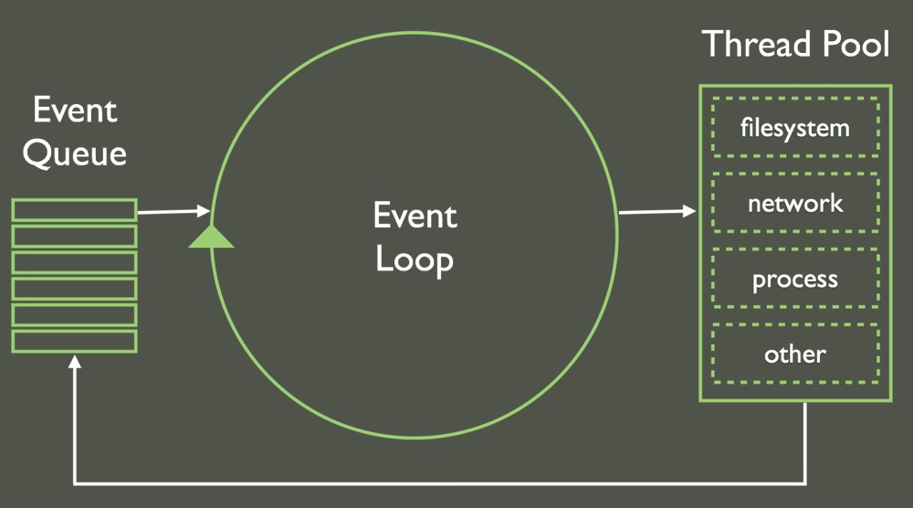

+++
title = "Node & NPM"
outputs = ["Reveal"]
+++

# Node & NPM

---

## Overview

- What is Node
- Using and exporting modules
- What is NPM
- Creating package.json
- Installing packages

---

# Node.js

---

## What is Node

Node.js® is a JavaScript runtime built on Chrome's V8 JavaScript engine.

- Open-source
- Asynchronous
- Event-driven architecture
- Non-blocking Input/Output API

---

### JavaScript Event Loop



---

## How to install Node.js

```sh
$ brew install node@10
```

Version 10 is "stable" the latest version is not.

---

### Node Modules

Organize your code into separate files.

- Separate context (no global scope)
- Similar to JavaScript libraries (ex: jQuery)
- `require()` to import
- `module.exports` or `exports` to export

---

### Importing Node Modules

```js
var module = require("module_name");
```

Example:

```js
var http = require("http"); // Node core object
http.createServer();
```

---

## Default Exports

```js
// person.js
var name = "Josh";
// Supports a variable or function or object
module.exports = name;
// or
exports = name;
```

The `module.exports` is a special object which is included in every JS file in the Node.js application by default.

---

# Module Types

- Local Modules

```js
const person = require("./person");
const person = require("./data/person");
```

- Core Modules

```js
const http = require("http");
```

- Third Party Modules

```js
// npm installs to node_modules
const express = require("express");
```

---

## Hello World

```js
// hello-world.js
const http = require("http");

const hostname = "127.0.0.1";
const port = 3000;

const server = http.createServer((req, res) => {
  res.statusCode = 200;
  res.setHeader("Content-Type", "text/plain");
  res.end("Hello World\n");
});

server.listen(port, hostname, () => {
  console.log(`Server running at http://${hostname}:${port}/`);
});
```

```sh
$ node hello-world.js
```

---

## What is NPM

- Node.js Package Manager (2009)
- The npm Registry is a public collection of packages (npmjs.com)
- `npm` is the command line client (to install/publish modules)
- npm, Inc. is the company that hosts and maintains all of the above.

---

### Creating your own package

```sh
npm init
```

---

### Installing packages

```sh
$ npm install package-name
```

[Cowsay module](https://www.npmjs.com/package/cowsay)

```sh
$ npm install cowsay
```

```js
const cowsay = require("cowsay");
```

---

### Installing Global Modules

```sh
npm install -g cowsay
```

```sh
$ cowsay JavaScript FTW!
```

---

## Summary

- What is Node
- Using and exporting modules
- What is NPM
- Creating package.json
- Installing packages
