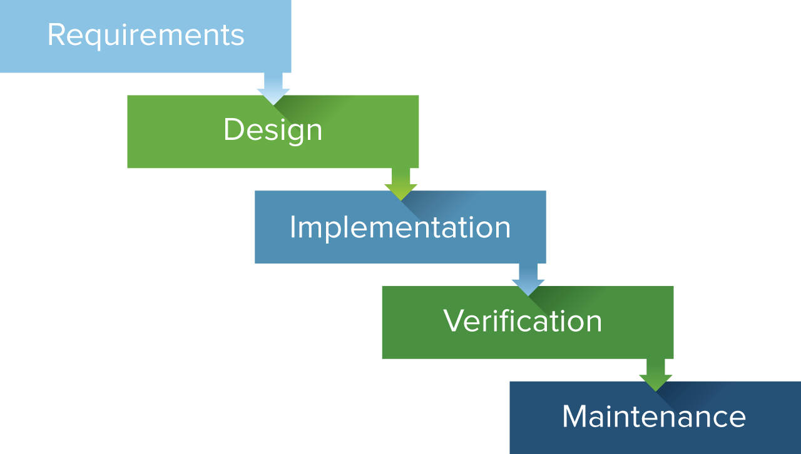
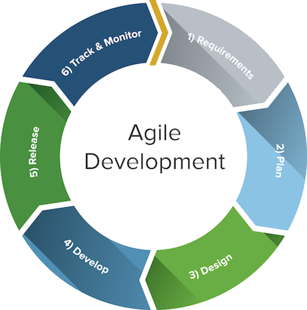
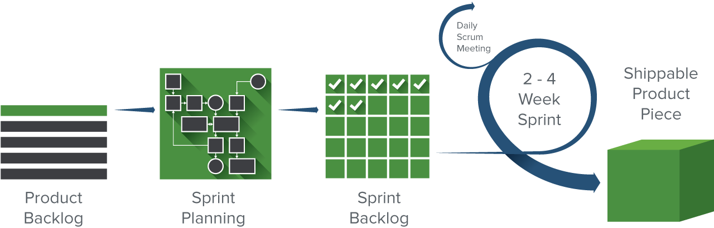
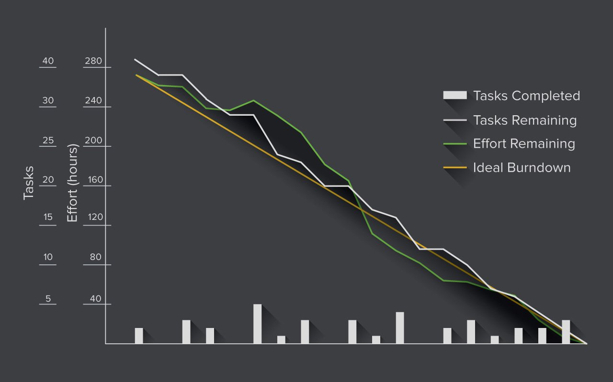
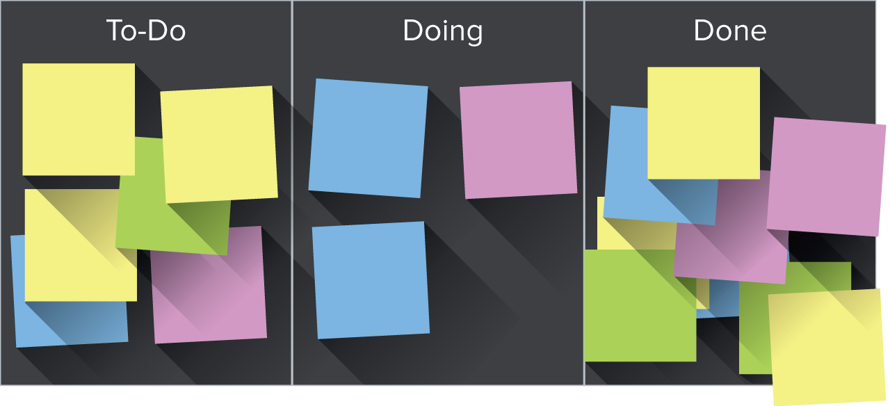

+++
title = "Project Management 101"
outputs = ["Reveal"]
+++

# Project Management 101

---

## Overview

- Waterfall
- Agile
- Kanban
- Scrum

---

## Waterfall

---

## What is Waterfall

- Sequential and linear process
- Origin: manufacturing and construction industries (1970)

---

### Advantages of Waterfall

- Easy to use and manage
- Discipline is enforced
- Requires a well documented approach

---

### Disadvantages of Waterfall

- Changes can’t be easily accommodated
- Software isn’t delivered until late
- Gathering accurate requirements can be challenging

---

#### Stages of Waterfall

---

### Stages of Waterfall

1. Conception
2. Initiation
3. Requirement Gathering and Analysis
4. Design
5. Implementation/Coding
6. Testing
7. Maintenance

---

## Agile

---

## What is Agile?

- Incremental, iterative process
- Origin: Manifesto for Agile Software Development (2001)
- Based off of [12 principles](http://agilemanifesto.org/principles.html)

---

## Advantages of Agile

- Change is embraced
- End-goal can be unknown
- Faster, high-quality delivery
- Strong team interaction
- Customers are heard
- Continuous improvement

---

## Disadvantages of Agile

- Planning can be less concrete
- Team must be knowledgeable
- Time commitment from developers
- Documentation can be neglected
- Final product can be very different

---

### The Agile Development Cycle

---

### The Agile Development Cycle

- Planning
- Requirements analysis
- Design
- Implementation, coding or development
- Testing
- Deployment

---

### Budget Estimates in Agile

**User Story:**
"As a _{type of user}_, I want _{some goal}_ so that _{some reason}_."

- User stories broken into tasks
- Planning poker

---

### Agile and Pair Programming

- “Pairing”
- Sharing one screen, keyboard, and mouse
- Encourages better communication, clarification of the problem, and understanding of the solution

---

## Scrum

---

### What is Scrum

- Subset of Agile
- Two week "sprints"
- Origin: Jeff Sutherland (1993) from manufacturing study (1986)

---

## Advantages of Scrum

- More transparency and project visibility
- Increased team accountability
- Easy to accommodate changes
- Increased cost savings

---

### Disadvantages of Scrum

- Risk of scope creep
- Team requires experience and commitment
- The wrong Scrum Master can ruin everything
- Poorly defined tasks can lead to inaccuracies

---

## Roles in Scrum

- Product Owner
- Scrum Master
- Scrum Team (5-7 people, 2 pizza rule)

---

### Steps in the Scrum Process

---

### Steps in the Scrum Process

- Product backlog
- Sprint planning
- Backlog refinement/grooming
- Daily Scrum meetings (15 min standup)
- Sprint review meeting (demo)
- Sprint retrospective meeting

---

### Scrum Burndown Chart

---

## Kanban

---

## What is Kanban?

- “Visual sign” or “card” (in Japanese)
- Visual implementation of Agile
- Origin: inspired by the Toyota Production System (1940s)
- "Just-in-time" (JIT) product system

---

## About the Kanban Board

---

## Advantages of Kanban

- Increases flexibility
- Reduces waste
- Easy to understand
- Improves delivery flow
- Minimizes cycle time

---

### Disadvantages of Kanban

- Outdated board can lead to issues
- The board can become overcomplicated
- Lack of timing

---

#### Core Practices and Principles of Kanban

- Visualize the workflow
- Limit work in progress (WIP)
- Manage and enhance the flow
- Make process policies explicit
- Continuously improve (Kaizen)

---

## Summary

- Waterfall
- Agile
- Kanban
- Scrum

Credit: [Smartsheet](https://www.smartsheet.com/agile-vs-scrum-vs-waterfall-vs-kanban)

---
