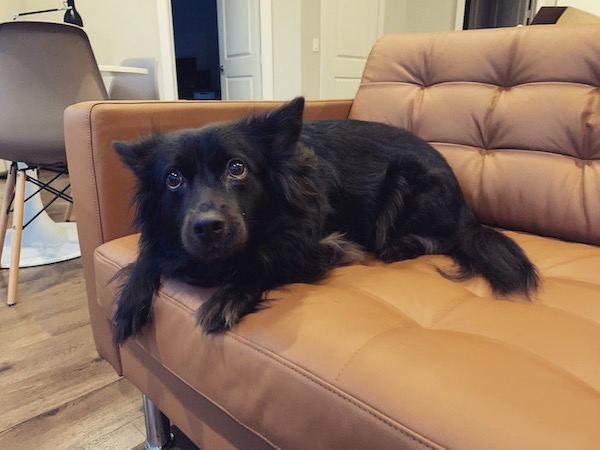
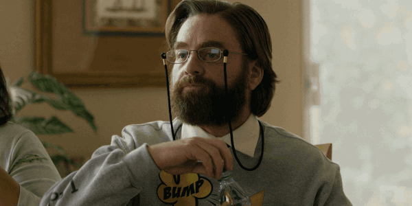

+++
title = "Welcome"
outputs = ["Reveal"]
+++

# Welcome

It's your first day at the DigitalCrafts 
Fulltime Immersive Program!

---

## Overview

- Introduction
- Logistics
- Resources
- Tips for Success
- Q&A

---

{}

# Who am I?

---

## My Career

- Designer (formal)
  - Graphic designer
  - Web designer
- Developer (self taught)
  - WordPress developer
  - Front-end developer (Angular)
  - Team lead (Scrum/Kanban)

---

## Interests/Hobbies

- Food
- Movies
- Music
- Reading
- Tech
- Gaming
- Close-up magic

---

## Anna

---

## Your Turn

Introduce yourself and tell us:

1. Name and where you are from originally
2. Why you joined DigitalCrafts
3. What food could you not live without?

{}

---

{}

# Logistics

---

## Schedule

| Activity | Times |
| -------- | ----- |
| Lectures | 9-12  |
| Lunch    | 12-1  |
| Lab      | 1-4   |

(Friday afternoon sharing)

---

## Schoology

Learning portal for presentations, exercises, etc...

---

## Support Line

1. Attempt to figure it out yourself
2. Look it up
3. Ask a peer
4. Ask a DIR
5. Ask Instructor (me)

{}

---

{}

# Tips for Success

---

## Stay Hydrated

A hydrated brain is a happy brain

---

## Do the Work

> "to learn and not to do is really not to learn. To know and not to do is really not to know."
>
> - Stephen R. Covey

---

## Get Good Sleep

> "Man is a genius when he is dreaming."
>
> - Akira Kurosawa

---

## Make Friends

> "We can't help everyone, but everyone can help someone."
>
> - Ronald Reagan

{}

---

# Q&A

---

# Done

[Back to home](/#/1)
