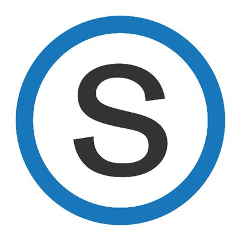
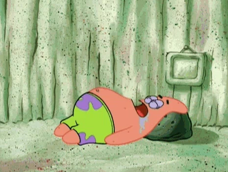

+++
title = "Welcome"
outputs = ["Reveal"]
+++

# Welcome

It's your first day at the DigitalCrafts 
Fulltime Immersive Program!

---

## Overview

- Introduction
- Logistics
- Resources
- Tips for Success
- Q&A

---

{}

# Who am I?

---

## My Career (8+ years)

- Designer (formal)
  - Graphic designer
  - Web designer
- Developer (self taught)
  - WordPress developer
  - Front-end developer (Angular)
  - Team lead (Scrum/Kanban)

---

## Interests/Hobbies

- Movies
- Music
- Mechanical keyboards
- Close-up magic
- Personal development

---

## Anna

{}

---

{}

# Logistics

---

## Schedule

- Monday to Friday (9am-4pm)
  - Morning: lecture (be on time!)
  - Lunch Break (~12pm-1pm)
  - Afternoon: work & projects

---

## Certification Requirements

- 7 absences (or less)
- 2 passing quizzes
- 3 major projects completed

---

## Schoology

Learning portal for presentations, exercises, etc...

---

## Support Line

1. Attempt to figure it out yourself
2. Look it up
3. Ask a peer
4. Ask a DIR
5. Ask Me

{}

---

{}

# Tips for Success

---

## Hydrate

A hydrated brain is a happy brain

---

## Exercise

Do the work, grow your skills

---

## Sleep

The secret to retaining information

{}

---

# Q&A
